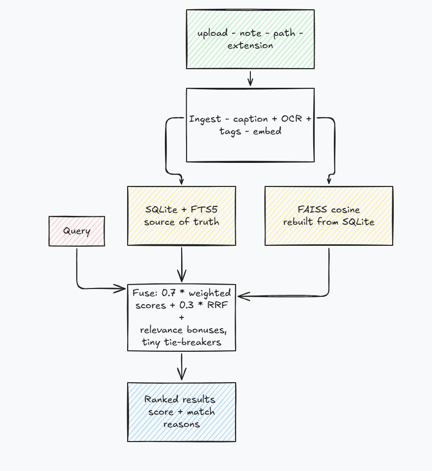

# Recall


Local-first multimodal personal memory and retrieval. Save webpages, images,
screenshots, PDFs, and notes - find them later with hybrid lexical + semantic
search. No cloud, no accounts, no LLM at query time.

> Think at ingest. Retrieve deterministically.

[](https://youtu.be/1NzE_2FwT_U)

*Click for the video walkthrough.*

## Quickstart

```bash
./script.sh --seed          # install (all extras), test, build UI, seed 2 demos, start
./script.sh --help          # all flags (--extras, --skip-tests, --prefetch-models, --no-frontend)
```

Needs Python ≥3.10, `uv`, and `node` (for the React build).
Open `http://localhost:8000`.

> EmbeddingGemma downloads are gated: accept the Gemma terms at
> `huggingface.co/google/embeddinggemma-300m` and `export HF_TOKEN=…`
> before first run if you want the top-quality embeddings. Without it Recall
> falls back to MiniLM, then to offline hash vectors - search keeps working.

```bash
# single file
curl -F "files=@shot.png" -F "source=https://github.com/…" localhost:8000/api/upload
# text note
curl -X POST localhost:8000/api/memories \
  -H 'Content-Type: application/json' \
  -d '{"title":"FAISS notes","content":"vector index for dense retrieval"}'
# server-side path
curl -X POST localhost:8000/api/ingest \
  -H 'Content-Type: application/json' \
  -d '{"path":"/abs/path/to/file.pdf"}'
```

## Architecture

AI runs once at ingest; search is deterministic (SQLite + BM25 + FAISS).
The database is authoritative - FAISS is an in-RAM cache rebuilt from SQLite.



AI runs once at ingest; search is deterministic (SQLite + BM25 + FAISS).
The database is authoritative - FAISS is an in-RAM cache rebuilt from SQLite.
Ranking mixes calibrated BM25/dense scores (`w_bm25` / `w_dense` settings)
with an RRF term; only relevance signals get large bonuses, so engagement
stats can never outvote a better match.
See `docs/KNOWLEDGE.md` for decisions, tradeoffs, and licenses.

## Features

- **Dashboard** - stats, quick capture, recent memories.
- **Search Studio** - hybrid search with type, website-category, dwell-time,
  and date filters, plus match-reason chips per result.
- **Memory Library** - filter, inspect, batch-delete, JSON export/import.
- **Knowledge graph** - term/memory/domain web of your collection.
- **Models & AI** - backend status, live benchmark, embedding playground.
- **Browser extension** (`extension/`) - explicit per-click web clips with
  dwell-time tracking; re-captures update instead of duplicating.

## API

```text
GET  /api/health
GET  /api/memories  GET /api/memories/{id}  GET /api/memories/{id}/file
POST /api/memories  PATCH /api/memories/{id}  DELETE /api/memories/{id}
POST /api/memories/batch-delete
POST /api/upload                       (multipart files + optional source)
POST /api/search
POST /api/ingest   GET /api/ingest/{id}
GET  /api/stats    GET /api/models    POST /api/rebuild
GET  /api/settings  POST /api/settings
POST /api/tools/optimize  POST /api/tools/benchmark  POST /api/tools/embed-test
GET  /api/tools/export     POST /api/tools/import
POST /api/extension/ingest  POST /api/extension/dwell
GET  /api/graph
```

## Optional extras

```bash
./script.sh --extras test,pdf   # light install (caption/OCR/embeddings fall back gracefully)
```

Without AI extras, embeddings use a deterministic offline fallback and
caption/OCR return empty strings - search (BM25 + fallback vectors +
metadata) still works.

## Frontend dev (React + BoardUI)

```bash
cd frontend && npm install && npm run dev   # Vite on :5173, proxies /api → :8000
```

Free BoardUI components live as source under `frontend/components/`
(`button`, `input`, `textarea`, `file-upload`, `tabs`, `badge`, `chip`,
`sidebar`, `stat-cards`, `table`, `settings-modal`, `theme-toggle`,
`dropdown`, `tooltip`, `divider`, `select`). Pro components require a paid
license - do not add them. Production build (`npm run build` → `frontend/dist/`)
is served by FastAPI.
